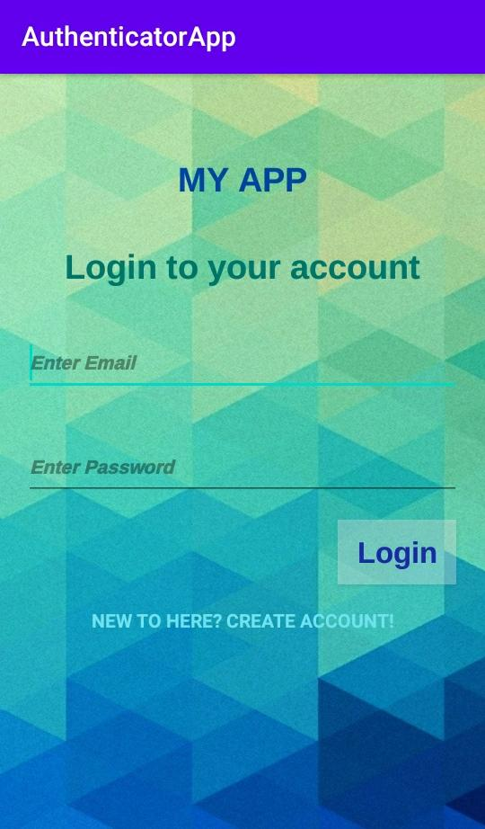
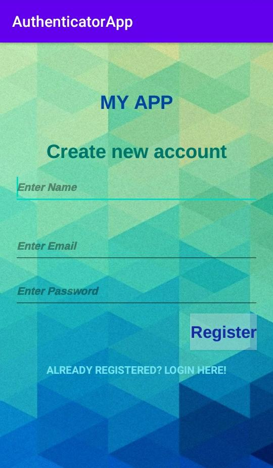

# AuthenticationAppWithFirebasse
A simple authentication application developed on Android Studio.
The user can sign up with name, email id, and a password. The email field cannot be empty. The password must be at least six characters long. 
All the credentials are sent to firebase accountand to login the credentials must be matched by firebase.
Aloding icon is added so that it does not seem like the app freezed, while the credentials are matched.
Link to login in the register page and link to register in login page.
The logout button will take the user to login page.

 # In Action:
This is the login page in the app

This is the register page in the app

This is the logging in page in the app

This is the logged in page in the app

# Authors:
Srinidhi Ayyagari

# Acknowledgement:
Would like to thank all the resources on Youtube and Stack Overflow always! :)

